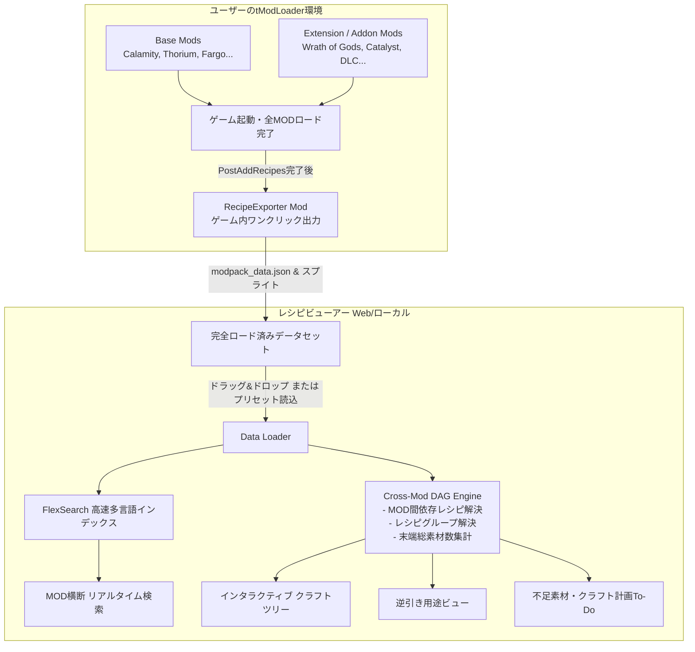

# Terraria & tModLoader 全MOD・拡張MOD対応レシピビューアー 詳細設計書

## 1. プロジェクト概要

### 1.1 背景と目的
『Terraria』および『tModLoader』環境では、大型MOD（Calamity, Thorium, Fargo's Souls, Stars Above 等）に加え、**MODの拡張・アドオンMOD（Calamity Addons, Fargo's DLC, Cross-Mod Compatibility MOD等）**を多数併用することが一般的です。
これにより、以下のような極めて複雑なレシピ問題が発生します：
- **MOD間レシピ連携（Cross-Mod Recipes）**: あるMODが別のMODの素材を要求するレシピ
- **動的レシピ改変**: アドオンMODが既存のMODやバニラのレシピを上書き・削除・条件追加する動的処理
- **巨大な多段クラフトツリー**: 何十段階もの中間素材を必要とするエンドコンテンツアイテム

本プロジェクトは、**ユーザーの環境に導入されている「すべてのMOD・拡張MOD」のレシピを完全網羅**し、多段クラフトツリーと総素材数を瞬時に逆引き・可視化できるツールの設計書です。

### 1.2 コア設計思想
1. **動的レシピ完全追従（Dynamic Recipe Capture）**: 静的解析ではなく、ゲーム内で全MODがロードされレシピ改変が完了した最終状態（`PostAddRecipes`）のメモリから直接全データをエクスポートする。
2. **MOD非依存（Mod-Agnostic）**: 特定のMODに依存せず、未知のマイナーMODや自作MOD、将来登場する新MODも含めて100%同一フォーマットで自動対応。
3. **ローカル環境即時反映**: ユーザー自身のMOD環境（ModPack）からワンクリックでデータを書き出し、即座にWebビューアーにインポート可能。

---

## 2. システムアーキテクチャ



---

## 3. 全MOD対応のためのデータ抽出設計（Game-Side Exporter）

### 3.1 tModLoader Exporter MOD (`RecipeDumperMod`)
全MODのレシピ変更を100%正確に捉えるため、ゲーム内MODとして以下を実装します：

- **フックタイミング**: `ModSystem.PostAddRecipes()`
  - 全てのMODの `AddRecipes()` およびレシピ修正が完了した直後に実行。
- **抽出対象データ**:
  1. **アイテム一覧 (`ItemLoader`)**:
     - 内部名（`ModItem.FullName` / `ModItem.Name`）
     - 表示名（多言語ローカライズ対応: `Lang.GetItemNameValue()`）
     - MOD名（`Mod.Name`）
     - ツールチップ、レアリティ、素材フラグ（`item.material`）、売却値、最大スタック数
     - アイテムテクスチャ（Base64またはPNGスプライトシート）
  2. **レシピ一覧 (`Main.recipe`)**:
     - レシピID、完成品アイテムID、完成スタック数
     - 必要素材リスト（アイテムID、要求スタック数、レシピグループ判定）
     - 必要作業台タイル（`recipe.requiredTile`）
     - 必要条件（`recipe.Conditions`: 水/溶岩/ハチミツ、エクリプス中、墓場バイオーム等）
  3. **レシピグループ (`RecipeGroup.recipeGroups`)**:
     - 全レシピグループ（「Any Iron Bar」「Any Wood」「Any Mythril Anvil」等）とそれに該当するアイテムIDリスト

---

## 4. データ構造仕様（Universal Schema）

全MOD・拡張MODを汎用的に表現するスキーマ設計です。

### 4.1 アイテムデータ (`items.json`)
```json
{
  "CalamityMod:Terraprisma": {
    "id": "CalamityMod:Terraprisma",
    "mod": "CalamityMod",
    "internalName": "Terraprisma",
    "displayName": {
      "en": "Terraprisma",
      "ja": "テラプリズマ"
    },
    "tooltip": ["Summons ethereal swords"],
    "rarity": 10,
    "maxStack": 1,
    "isMaterial": true,
    "icon": "data:image/png;base64,..."
  }
}
```

### 4.2 レシピデータ (`recipes.json`)
```json
[
  {
    "id": 10542,
    "result": { "id": "FargowiltasSouls:EternitySoul", "stack": 1 },
    "ingredients": [
      { "id": "FargowiltasSouls:UniverseSoul", "stack": 1 },
      { "id": "FargowiltasSouls:DimensionSoul", "stack": 1 },
      { "id": "CalamityMod:ShadowspecBar", "stack": 5, "note": "Cross-Mod Recipe" },
      { "recipeGroup": "AnyGoldBar", "stack": 10 }
    ],
    "tiles": ["Fargowiltas:CrucibleOfTheCosmos"],
    "conditions": ["DownedMutant"],
    "mod": "FargowiltasCrossmod"
  }
]
```

---

## 5. クラフトツリー（DAG）& 拡張MOD依存解決エンジン

### 5.1 循環依存・多重ルート対策
拡張MODが入ると、同一アイテムに複数の作成ルートが存在したり、レシピ改変MODによって循環参照が生じるリスクがあります。
- **最短・最小コストルート探索**: レシピが複数ある場合、ユーザーが「どのレシピを使用するか」を選択可能にする。
- **深さ優先探索（DFS）とループ検知**: 訪問済みノードのセットを追跡し、無限ループを回避。
- **MOD間レシピの視認性向上**: 素材ノードごとにどのMODのアイテムか一目でわかるMODバッジカラーを付与。

### 5.2 合計素材計算（Raw Material Aggregator）
1. 目的のアイテムから再帰的に子素材ノードを展開。
2. これ以上分解できない「基本素材（鉱石、敵ドロップ、NPC購入品など）」を特定。
3. 全ツリーから必要総数を合算し、ツリー右側のサマリーテーブルに集計。
4. レシピグループ（例: Iron / Lead）の場合はユーザーが優先素材を選択可能。

---

## 6. UI / UX 仕様

### 6.1 画面構成
```
+-------------------------------------------------------------------------------+
| [Search...] (Ctrl+K)  | [MOD Filter: All (12 Mods)] | [Lang: JA/EN] | [⚙ Settings] |
+-------------------------------------------------------------------------------+
| [アイテム一覧]        | [選択アイテム詳細: Soul of Eternity]                        |
| - Filter by Mod:     | +-----------------------------------------------------------+ |
|   [x] Calamity       | | Icon  Soul of Eternity (Fargo's Souls DLC)                | |
|   [x] Fargo Souls    | |       Rarity: Rainbow | Material: Yes                     | |
|   [x] Fargo DLC      | +-----------------------------------------------------------+ |
|   [x] Thorium        | [タブ: レシピ(How to) | 用途(Used in) | クラフトツリー | 総素材] |
|                      | +-----------------------------------------------------------+ |
| 検索結果(5,420件):   | | [Interactive Crafting Tree Canvas]                        | |
| > Soul of Eternity   | |   Eternity Soul                                           | |
| > Terra Blade        | |    ├── Universe Soul (Fargo)                              | |
| > Auric Tesla Bar    | |    ├── Dimension Soul (Fargo)                             | |
|                      | |    └── Shadowspec Bar (Calamity)                          | |
|                      | |         └── Auric Bar ...                                 | |
+-------------------------------------------------------------------------------+
```

### 6.2 主なUI機能
- **ドラッグ＆ドロップ インポート**: ユーザーが出力した `modpack_data.json` をブラウザにドラッグするだけで、その環境のレシピビューアーに即座に切り替わる。
- **MOD別カラーリング**: 各MODに固有のテーマカラー（Calamity: 赤橙, Thorium: シアン, Fargo: 紫, Vanilla: 緑 等）を自動割り当てし、どのMODの素材かが視覚的に直感把握可能。
- **ズーム・パン可能なツリー**: 100ノードを超える巨大ツリーでもスムーズに縮小・拡大・部分折りたたみ（Collapse/Expand）可能。

---

## 7. 実装ステップ & ロードマップ

1. **Step 1: Webビューアー基盤 & サンプルデータプロトタイプ（即時着手）**
   - React + TypeScript + Vanilla CSS によるビューアーの作成
   - 巨大MOD（Calamity, Fargo's, バニラ）を模した多段・Cross-Modレシピのテストデータ作成
   - 高速検索・正引き・逆引き・ツリー展開・総素材計算エンジンの実装
2. **Step 2: tModLoader Exporter MOD（C#）の作成**
   - ユーザーのゲーム内から1ボタンで全MODの `ItemLoader` / `Recipe` / `RecipeGroup` をJSONとして書き出す軽量MODのコード提供
3. **Step 3: UIポリッシュ & インポート機能**
   - JSONファイル読込・IndexedDBキャッシュ・レスポンシブUIの最適化
