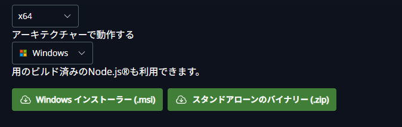
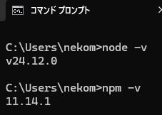

# Node.jsのインストール　ガイド

本ガイドでは、このツールで使用するNode.jsのインストールの方法を説明します。

## Node.jsのインストール
[Node.js](https://nodejs.org/ja)の公式サイトにアクセスして、Node.jsのインストーラーをダウンロードします。   
公式サイトにアクセスしたら、「Node.js®を入手」をクリックします。クリックするとNode.jsのダウンロード方法を選択できるようになります。  
画面少し下にあるWindows用のNode.jsインストーラー(.msi)をダウンロードします。  
  
ダウンロードしたらインストーラーを起動してNode.jsをインストールしてください。
インストールが完了したらコマンドプロンプトを起動し、以下の２つのコマンドを実行してください。
```bash
node -v
npm -v
```
正常にインストールができている場合、以下の画像の通りバージョンが表示されます。  
  
もし表示されない場合は再度インストールしてみてください。
