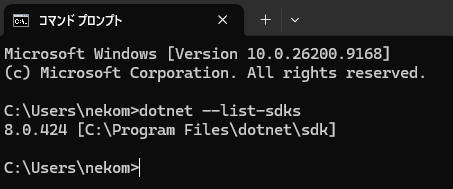

# tModLoader レシピ＆画像データ一括エクスポート ガイド

本ガイドでは、ご自身の tModLoader 環境（バニラ＋導入中の全MOD＋拡張アドオンMOD）から、すべてのアイテム・レシピ・テクスチャ画像をワンクリックで書き出して本 Web ビューアーに読み込ませる手順を説明します。

---

## 📋 全体の流れ

1. **事前準備**: [.NET 8 SDK](#-1-事前準備-net-8-sdk-のインストール) のインストール
2. **MOD導入**: [エクスポートMOD（RecipeDataExporter）](#-2-エクスポートmodの導入手順) の配置とビルド
3. **データ出力**: [レシピデータと画像ZIP](#-3-データの出力とwebビューアーへの読み込み) の生成
4. **閲覧**: Web ビューアーへのインポート（ブラウザ内に自動永続保存）

---

## 🛠 1. 事前準備: .NET 8 SDK のインストール

tModLoader 1.4 で MOD をビルドするために、Microsoft 公式の **.NET 8 SDK (64bit / x64)** をインストールします。

1. [.NET 8 SDK ダウンロードページ](https://dotnet.microsoft.com/en-us/download/dotnet/8.0) にアクセスします。
2. **「Installers」** の項目から、**Windows > x64** を選択してダウンロード・インストールします。
   > [!IMPORTANT]
   > 必ず **64bit版（x64）** を選択してください（x86 / 32bit版だとビルド時にエラーになります）。

3. インストール後、コマンドプロンプトを開いて確認コマンドを実行します：
   ```bash
   dotnet --list-sdks
   ```
4. 以下のように `8.0.xxx [C:\Program Files\dotnet\sdk]` と表示されれば完了です：



---

## 📦 2. エクスポートMODの導入手順

1. **ModSources フォルダを開く**:
   - エクスプローラーで以下のフォルダを開きます：
     ```text
     Documents\My Games\Terraria\tModLoader\ModSources
     ```
2. **フォルダ `RecipeDataExporter` を作成**:
   - `ModSources` 内に `RecipeDataExporter` フォルダを作成します。
     - パス: `Documents\My Games\Terraria\tModLoader\ModSources\RecipeDataExporter`

3. **ファイルの配置**:
   - 本リポジトリの [`exporter/RecipeDataExporter.cs`](../exporter/RecipeDataExporter.cs) を上記フォルダ内にコピーします。
   - 同じフォルダ内に、テキストエディタで以下の内容の `build.txt` を作成します：
     ```txt
     displayName = Recipe Data Exporter
     author = LocalUser
     version = 1.0.0
     ```

4. **ゲーム内でビルド＆有効化**:
   - `tModLoader` を起動します。
   - メインメニューから **「Workshop (ワークショップ)」 > 「Develop Mods (Mod開発)」** を開きます。
   - リストに表示された **「Recipe Data Exporter」** の **「Build + Reload」** をクリックします。

---

## 📤 3. データの出力とWebビューアーへの読み込み

### ステップ A: レシピデータの自動出力 & 読み込み

1. **レシピデータの自動出力**:
   - MOD を有効化してゲームを起動すると、`Adding Recipes...` 画面の通過時（約0.1秒）に、自動的にレシピデータが出力されます：
     - 保存場所: `Documents\My Games\Terraria\tModLoader\modpack_data.json`
2. **Webビューアーへインポート**:
   - Web ビューアーを開き、画面中央または右上のインポート画面に `modpack_data.json` をドラッグ＆ドロップ（またはファイル選択）します。
   - **一度読み込めばブラウザに自動保存されるため、次回からは起動するだけで即座に閲覧できます。**

---

### ステップ B: 全MODアイテム画像の出力 & 登録（任意・完全オフライン対応）

バニラや主要 MOD の画像は高速 CDN により自動表示されますが、オリジナル MOD やマイナー MOD のテクスチャも 100% 完全表示したい場合は以下の手順を行います：

1. **ゲーム内でコマンドを実行**:
   - 任意のワールドに入り、チャット欄に以下を入力して Enter を押します：
     ```text
     /exporticons
     ```
2. **ZIPファイルの自動生成**:
   - 数秒で全アイテムのテクスチャ抽出が行われ、完了すると自動的に 1 つの ZIP ファイルが生成されます：
     - 保存場所: `Documents\My Games\Terraria\tModLoader\modpack_icons.zip`
3. **Webビューアーへインポート**:
   - Web ビューアー右上の **「MODデータ読込」 > 「2. アイテム画像」タブ** を開きます。
   - **「ZIPファイルを選択」** ボタンをクリックし、上記の `modpack_icons.zip` を選択します。
   - 数万件のアイコンがブラウザに永続保存され、次回以降 0ms で超高速表示されます。

---

## ❓ よくある質問・トラブルシューティング

### Q1. 「Develop Mods」画面で「.NET SDK をインストールしてください」と表示される
- **対処法**: .NET 8 SDK（x64）をインストールした後、tModLoader を一度完全に終了して再起動してください。それでも認識されない場合は PC を再起動してください。

### Q2. MOD の構成（MODの追加・削除・更新）を変えたときは？
- tModLoader を再起動すると最新の `modpack_data.json` が自動更新されますので、再度 Web ビューアーにドロップするだけで最新レシピに更新されます。
